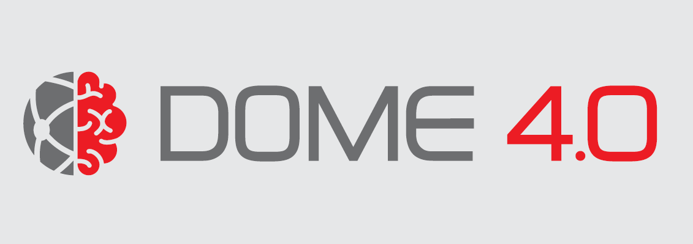

# AiiDAlab Application Registry

This repository contains the **database** of the official App registry for [AiiDAlab](https://www.materialscloud.org/aiidalab).

<p align="center">
 <a href="http://aiidalab.github.io/aiidalab-registry" rel="Go to AiiDAlab app registry">
  
 </a>
</p>

## How to add an app to the registry

Simply propose a change to the [apps.yaml](https://github.com/aiidalab/aiidalab-registry/blob/master/apps.yaml) file in this repository and add an entry for your app, for example:

```yaml
hello-world:
  releases:
    - "git+https://github.com/aiidalab/aiidalab-hello-world.git@master:"
```
Tip: You can directly edit the [apps.yaml](https://github.com/aiidalab/aiidalab-registry/blob/master/apps.yaml) file within the GitHub interface, by clicking on the pencil icon in the top right corner.

Please see the [AiiDAlab documentation](https://aiidalab.readthedocs.io/en/latest/app_development/publish.html) for detailed instructions on how to add an app to the registry.

## Information for maintainers

To generate the website, simply execute the following script:

```console
$ ./build.sh
```

The continuous-integration workflow is implemented with GitHub actions, which runs the pre-commit hooks and tests whether the registry can be built.
In addition, all commits on the `main` branch are automatically deployed to GitHub pages.

To manually trigger the CI workflow to deploy the registry, go to the [Actions tab](https://github.com/aiidalab/aiidalab-registry/actions) and click on the "Run workflow" button of the deploy workflow.

### Versioning and migrations

* The public registry API specification is maintained under `src/static/api/openapi-v{version}.yaml`.
  Explore the [interactive version](https://petstore.swagger.io/?url=https://aiidalab.github.io/aiidalab-registry/api/openapi-v1.yaml).
* The public registry API is published at `api/v{version}/` and is considered user-facing.
* The versioning of the API is semantic and all versions within one major version are backwards-compatible.
* The schemas for JSON files and responses are maintained within the aiidalab repository at https://github.com/aiidalab/aiidalab/tree/v21.10.0/aiidalab/registry/schemas .
* The schemas are considered implementation detail, but updates must still be made with care as the public API relies on some of the schemas.
* Should the number of apps maintained within this registry grow substantially, a re-implementation of the registry as a database application with RESTful API server should be considered. Such a re-implementation would likely require a migration to a new server (see next point).
* For a migration to a different server both the old and the new registry should be kept online concurrently during a reasonably long transition phase.

## Acknowledgements

We acknowledge support from:
* [MARVEL National Centre for Competency in Research](https://nccr-marvel.ch/) funded by the [Swiss National Science Foundation](https://www.snf.ch/en).
* [BIG-MAP project](https://www.big-map.eu) funded by the Horizon 2020 research and innovation programme (Grant No. 957189).
* [MARKETPLACE project](https://www.the-marketplace-project.eu/) funded by Horizon 2020 under the H2020-NMBP-25-2017 call (Grant No. 760173).
* [MaX European Centre of Excellence](https://www.max-centre.eu/) funded by the Horizon 2020 EINFRA-5 program (Grant No. 676598).
* [DOME 4.0 project](https://dome40.eu/) funded by the EU Horizon 2020 Research and Innovation Programme (Grant No. 953163)


<div style="display: flex; flex-wrap: wrap; justify-content: space-around; align-items: center; gap: 50px; text-align: center;">
 
 
 
 
 
 
</div>

